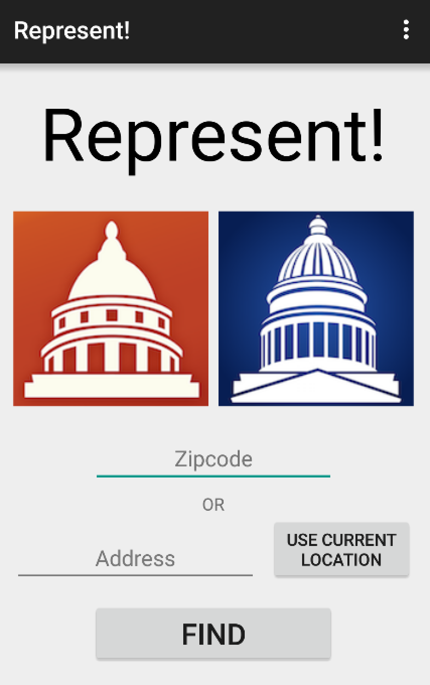
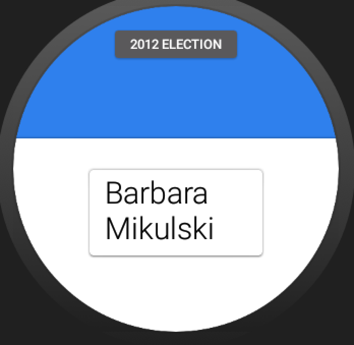
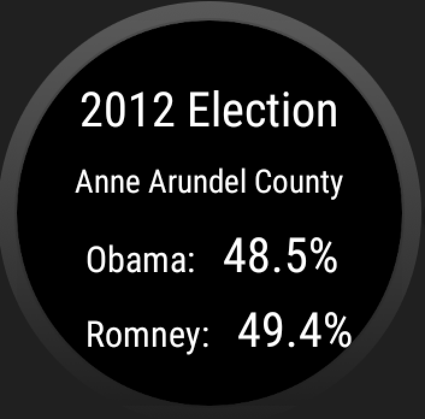

# PROG 02: Represent!

Represent! provides you with the information of the congressional representatives in anywhere, stating from your current location to an location you wish to see (as long as it's in US territory).

The app comes with a wearable version, where you can shake to randomly select a new location!

## Authors

Moonhyok Kim ([moonhyok@berkeley.edu](mailto:moonhyok@berkeley.edu))

## Demo Video

See [Final Quick Walkthrough] (https://www.youtube.com/watch?v=NK-qTNn8nko&feature=youtu.be)

See [Barebones(Part.B)] (https://www.youtube.com/watch?v=NK-qTNn8nko&feature=youtu.be)

## Screenshots

### Main View

### Congressional View
#### 3 Candidates

#### 4 Candidates

### Tweet View

### Detailed View
#### Democrat

#### Republican

### Main Watch View

### 2012 Election View

## Acknowledgments

Thank you Android Developer.
Twitter Api, Sunlight Foundation, Google Maps, *Peggy* for the json.